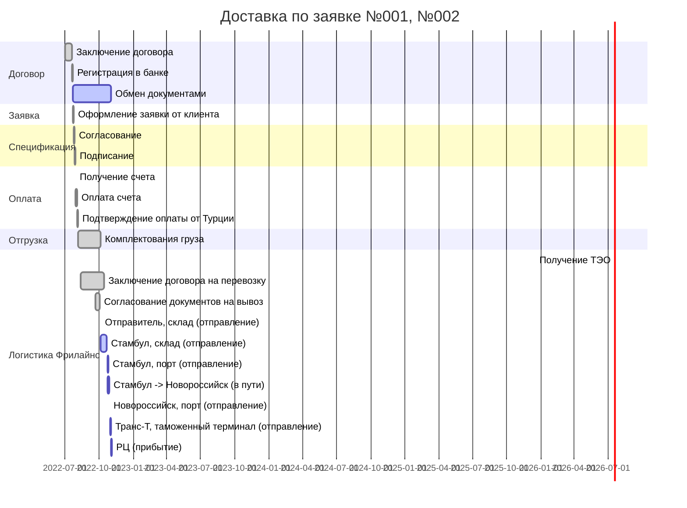

- title: 69832 - Заявка Фрилайнс (Каталкая)
- Заявка: 001, 002
- Спецификация: 001, 002, 003, 004
- Поставщик: Каталкая Макина
- Логистика: Фрилайнс

---

## Диаграмма Ганта


## TODO

- [ ] Оплата / Каталкая макина инвойсы 20220727 и 202220727-1
    - [x] Заказ поставщику в 1С
    - [x] Подписать спецификации
    - [x] Счет оплачен
    - [x] Дата прихода плановая
    - [ ] Получены первичные документы
    - [ ] Получить оригиналы спецификации


```topojson
{
  "type": "Topology",
  "transform": {
    "scale": [0.0005000500050005, 0.00010001000100010001],
    "translate": [100, 0]
  },
  "objects": {
    "example": {
      "type": "GeometryCollection",
      "geometries": [
        {
          "type": "Point",
          "properties": {"prop0": "value0"},
          "coordinates": [663939.53981855, 4542124.2470322]
        },
        {
          "type": "LineString",
          "properties": {"prop0": "value0", "prop1": 0},
          "arcs": [0]
        },
        {
          "type": "Polygon",
          "properties": {"prop0": "value0",
            "prop1": {"this": "that"}
          },
          "arcs": [[1]]
        }
      ]
    }
  },
  "arcs": [[[4000, 0], [1999, 9999], [2000, -9999], [2000, 9999]],[[0, 0], [0, 9999], [2000, 0], [0, -9999], [-2000, 0]]]
}
```